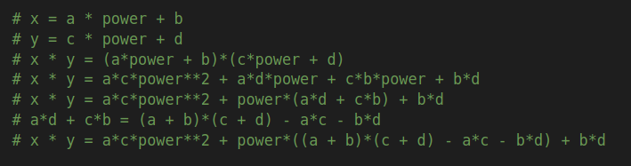
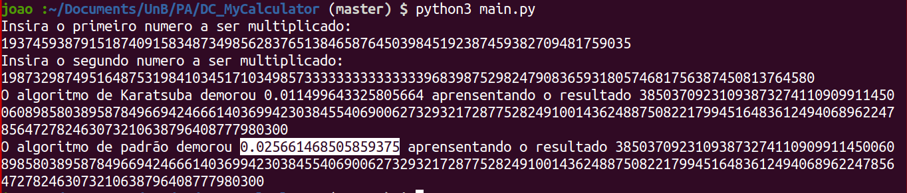

# MyCalculator

**Número da Lista**: 4
**Conteúdo da Disciplina**: DC (Dividir e conquistar)

## Alunos
|Matrícula | Aluno |
| -- | -- |
| 18/0033743  |  João Pedro Silva de Carvalho |
| 18/0028324  |  Thiago Luiz de Souza Gomes |

## Sobre 
É apenas uma calculadora que multiplica dois números. A diferença é que ele é mais rápido que o algoritmo naive e usa a divisão e conquista para melhorar o desempenho. Uma nota: ele é pior com numeros pequenos, mas melhora em relação ao naive quando aumenta o numero.

## Screenshots

 

 

 

## Instalação 
**Linguagem**: Python3.8

Necessita apenas do python3.8 instalado na máquina.

## Uso 

Na raiz do repositório apenas digite:

~~~Shell
python3 main.py
~~~

